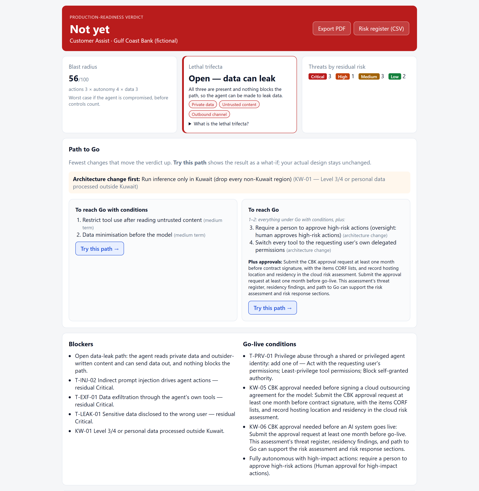
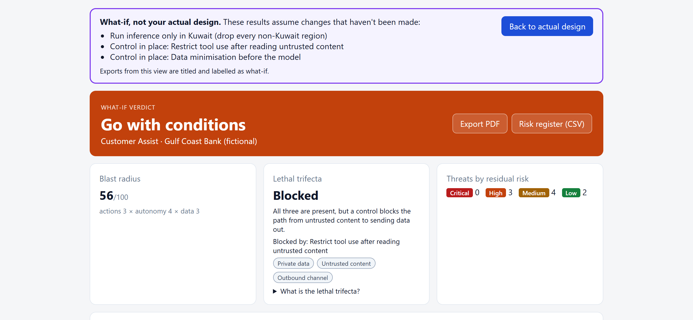
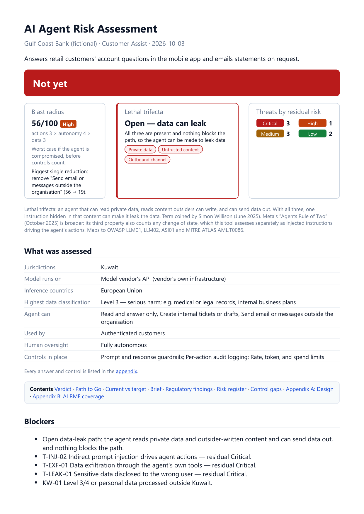

# Agent Risk Assessor

A presales tool for the question every AI pilot eventually hits: *can this agent go to production?* Describe an AI agent deployment — what it reads, what it can do, what it trusts, where it runs — and get a threat register, GCC data-residency findings, the fewest changes needed to go live, and a verdict a risk committee can sign against.

[Project Specification](PROJECT_SPEC.md) · [Sources](backend/data/SOURCES.md)

## What it does

1. **Profile** — organisation, sector, jurisdictions, where the model runs
2. **Architecture** — data reach, actions, untrusted inputs, autonomy, identity, supply chain, memory
3. **Controls** — what is actually in place today
4. **Results**
   - **Verdict** — Go, Go with conditions, or Not yet, with the blockers and conditions behind it
   - **Lethal trifecta check** — private data + untrusted content + an outbound channel means one injected instruction can leak data. Guardrails alone never break it.
   - **Path to Go** — the fewest controls, architecture changes, and approvals that lift the verdict. **Try this path** shows the result as a clearly bannered what-if without changing the design you entered; **Back to actual design** discards it
   - **Residency findings** — Kuwait (CITRA, NCSC NBCC, CBK CORF), Saudi Arabia (PDPL, SDAIA), UAE (PDPL, DIFC Regulation 10), Qatar (PDPPL, NCSA) — each with its clause
   - **Threat register** — 21 agent threats, each showing what triggered it and mapped to OWASP (LLM Top 10 2025, Agentic Top 10 2026) and MITRE ATLAS, MITRE's catalogue of attacks on AI systems
   - **NIST AI RMF coverage** — every AI RMF subcategory this design's risks touch, marked Gap / Partial / Addressed from the controls actually in place
   - **Risk register export** — CSV with NIST AI RMF subcategories per risk, ready for a governance file
   - **Risk committee brief** — a plain-language summary written by Claude from the assessment
   - **PDF export**

## Screenshots

The bank customer-service preset: a **Not yet** verdict, an open data-leak path, and the path to Go.



**Try this path** on the Go-with-conditions route. The banner lists every assumed change, and the verdict is labelled what-if.



Page 1 of the PDF export.



## Design choices

- **Deterministic.** The verdict, threats, and path come from rules in data files. The same inputs always give the same answer, and every finding shows the inputs that triggered it.
- **Claude writes one thing:** the brief. It is given the finished assessment and adds no findings. Without an API key, everything else still works. Each brief is written once per design and reused, a what-if gets one only on request, and the backend logs each call's tokens and approximate cost.
- **Verified references only.** Every framework ID and regulatory clause was checked against its source (see [SOURCES.md](backend/data/SOURCES.md)). Instruments that could not be verified — including ISO/IEC 42001, whose text is paywalled — are listed as not assessed rather than guessed.
- **Answers can't contradict each other.** Controls that restate a design answer (per-user permissions, human approval) follow that answer, controls that don't fit the design count for nothing, and conflicting answers resolve to the riskier reading, such as health data scored as at least Level 3.
- **Vendor-neutral.** Recommends control categories, never products.
- **Nothing persists.** State lives in the browser tab and clears when it closes.
- **What-ifs can't pass as the real thing.** A what-if never overwrites your answers, and its PDF and CSV are titled, bannered, and labelled on every row as what-if. **Change controls** returns to step 3 to update what is actually in place; in a what-if it reads **Edit actual controls**, because it edits your real design, not the what-if (which it discards).

## Known simplifications

- Each control in place lowers a threat's residual risk by one level, whatever its strength.
- It assesses a design as described. It does not scan code, prompts, or cloud configuration.
- It is a design-stage risk assessment, not a legal opinion or certification.

## Demo presets

Three fictional organisations load in one click: a bank customer-service agent (**Not yet** — trifecta plus a Critical Kuwait residency finding), an internal HR policy assistant (**Go**), and an autonomous procurement agent (**Not yet**).

## Stack

- **Backend** — Node.js / Express (ESM), port 3006
- **Frontend** — Vite + React, port 5181
- **AI** — Anthropic Claude, one call per assessment for the brief
- **PDF** — Puppeteer using the installed Chrome

## Quick start

### Option A — One-click launch (Windows)

Double-click **`Launch Agent Risk Assessor.cmd`**. It installs dependencies on first run, creates `.env` from `.env.example`, starts both servers, and opens http://localhost:5181. Add your `ANTHROPIC_API_KEY` to `.env` to enable the brief.

### Option B — Manual

```bash
cp .env.example .env            # optional: add ANTHROPIC_API_KEY

cd backend
PUPPETEER_SKIP_DOWNLOAD=true npm install
npm run dev                     # http://localhost:3006

cd ../frontend
npm install
npm run dev                     # http://localhost:5181
```

## Tests

```bash
cd backend && npm test          # engine rules
cd backend && npm run test:ui   # browser tests (about 45 s)
```

The engine suite checks that every rule references real fields, options, and controls; that every mapping ID is well-formed and every AI RMF reference exists; that each preset gives its expected verdict; that guardrails alone never break the trifecta; and that applying a suggested path to Go actually lifts the verdict.

The browser tests build the frontend, run a separate backend with no API key, and drive it in the installed Chrome: the presets, what-if isolation, brief reuse, read-only and not-applicable controls, contradiction warnings, phone-width layout, and PDF export. No Claude call is made.

## Environment

| Variable | Purpose |
|---|---|
| `ANTHROPIC_API_KEY` | Enables the risk committee brief. Optional. |
| `CLAUDE_MODEL` | Model for the brief. Defaults to `claude-opus-5-5`. |
| `PUPPETEER_EXECUTABLE_PATH` | Chrome path, if Puppeteer can't find the installed Chrome. |
| `PORT` / `CORS_ORIGIN` | Defaults 3006 / http://localhost:5181. |
