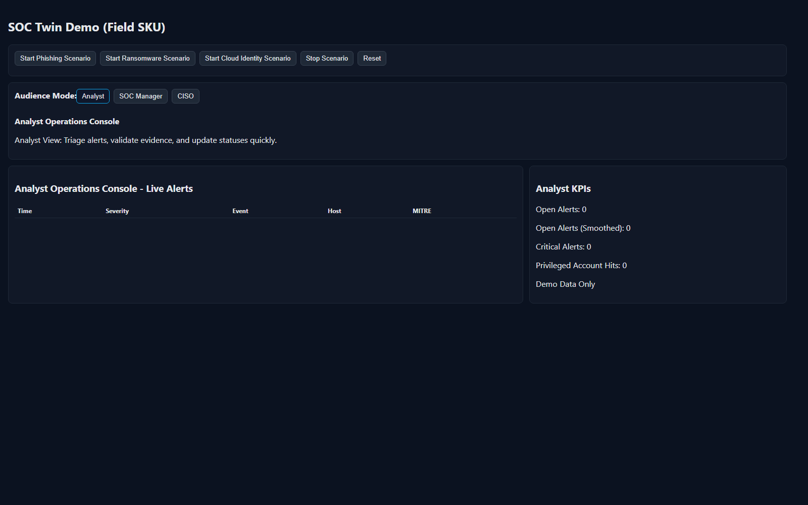
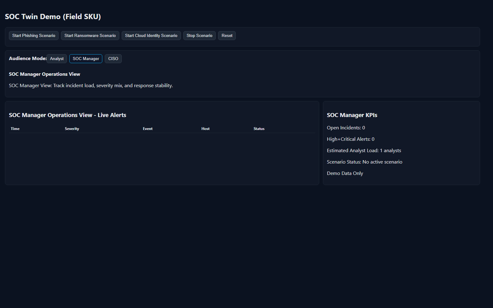
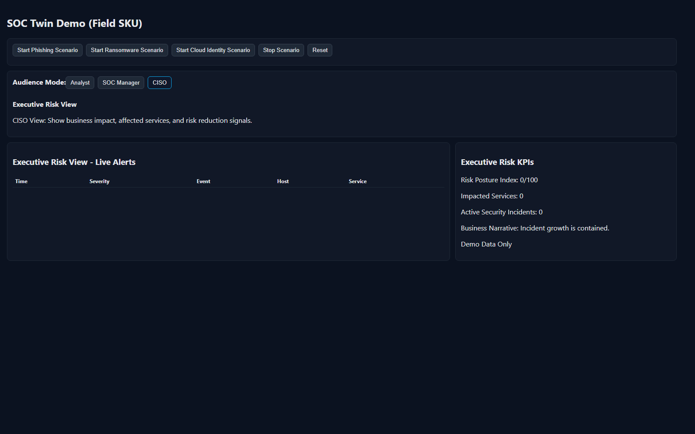

# SOC Twin (Field SKU v1)

Laptop-first simulated SOC environment for cybersecurity presales demos.

## Baseline for this laptop

- Backend background noise rate: 3200 ms
- Scenario noise rate: 1200 ms
- Recommended concurrent scenarios: 1 (enforced)
- Store: in-memory with alert cap (500)
- Branding: generic
- AI provider preference: OpenAI (provider adapter stub)

## Quick launch (recommended)

```bash
cd C:\Users\ksann\Downloads\soc-twin && npm.cmd run demo:launch
```

This launcher:
- Installs missing dependencies (backend + frontend)
- Starts backend in one terminal
- Runs `demo:prep` (reset + seed + health)
- Starts frontend in another terminal

Open: `http://localhost:5173`

## Manual start

1. Backend:

```bash
cd C:\Users\ksann\Downloads\soc-twin
npm.cmd install
npm.cmd run demo:start
```

2. Frontend:

```bash
cd C:\Users\ksann\Downloads\soc-twin\frontend
npm.cmd install
npm.cmd run dev
```

## Operator commands

```bash
npm.cmd run demo:prep
npm.cmd run demo:health
npm.cmd run scenario:phishing
npm.cmd run scenario:ransomware
npm.cmd run scenario:cloud-identity
npm.cmd run scenario:stop
npm.cmd run reset
```

## Stopping the demo

- UI stop (scenario only): Click `Stop Scenario`
- Full stop from terminal:
  - Backend window: `Ctrl+C`
  - Frontend window: `Ctrl+C`
- Closing both command windows also stops services.

## Runbooks

- Main script + talk track + discovery:
  - `runbooks/demo-script-talk-track-discovery.md`
- 10-minute executive script + FAQ:
  - `runbooks/executive-10min-script-and-faq.md`
- Quick operator start:
  - `runbooks/demo-quickstart.md`

## Notes

- v1 uses deterministic synthetic alerts for repeatable demos.
- No destructive payloads are executed.
- AI triage is currently a local stub until live provider wiring is enabled.
- On this machine, use `npm.cmd` instead of `npm` in PowerShell.
## Audience Mode behavior

Switching mode now changes visible dashboard content:
- Header title changes by mode (`Analyst Operations Console`, `SOC Manager Operations View`, `Executive Risk View`)
- Live table last column changes:
  - Analyst -> `MITRE`
  - SOC Manager -> `Status`
  - CISO -> `Service`
- KPI card content changes to role-specific metrics
## Audience Mode screenshots

Analyst mode:


SOC Manager mode:


CISO mode:
